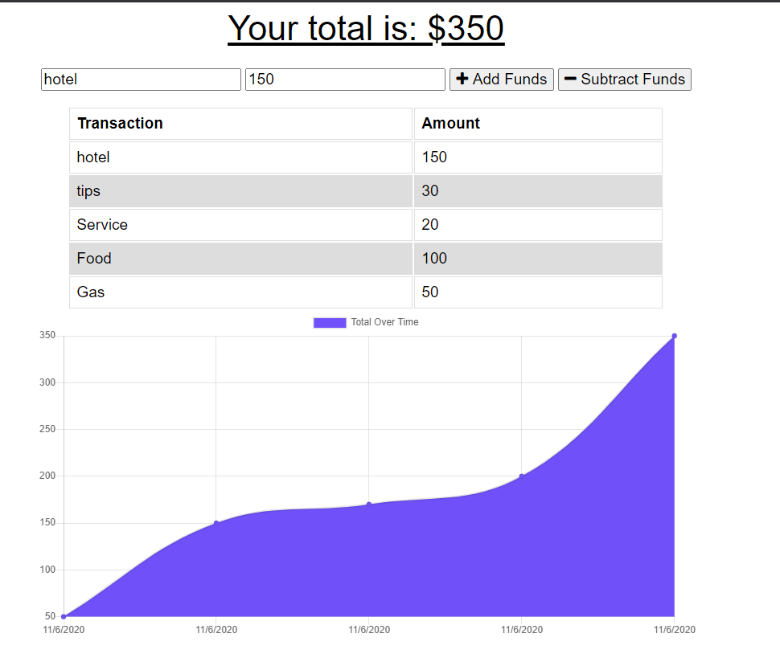

# HM18-BudgetTracker

### Heroku Link: https://infinite-stream-70267.herokuapp.com/git 

### GitHub Repo: https://github.com/AldoCarrillo/HM18-BudgetTracker

## Description

What this project does is a budget tracket for traveler who can save in the app the info of their trips, all the transactions to track the money.
The purpose of this app is save the data when is offline and update th data to te database when is back online.

-   Transaction
    -       Name
    -       Amount

You can add Funds or Subtracts Funds.

## Table of contents

-   [Installation](#installation)
-   [Usage](#usage)
-   [Test](#test)
-   [Credits](#credits)
-   [License](#license)
-   [Questiones](#Questiones)

## Installation

Run the terminal the main file called "server.js" with Node or use the deployed app on heroku.

## Usage

-   To Add a Transaction, type amount and click "Add Funds".
-   To Subtract a Transaction, type the amount then click "Subtract Funds" .
-   Once you add or subtract a transaction you will see a graphic with all the transactions.

## Main Page

## Test

"Node server.js"

Go to http://localhost:3000/ or heroku app

Add a new transaction

check the graphic below

## Credits

-   Aldo Carrillo

## License

MIT License

Copyright (c) 2020 Aldo Carrillo

Permission is hereby granted, free of charge, to any person obtaining a copy
of this software and associated documentation files (the "Software"), to deal
in the Software without restriction, including without limitation the rights
to use, copy, modify, merge, publish, distribute, sublicense, and/or sell
copies of the Software, and to permit persons to whom the Software is
furnished to do so, subject to the following conditions:

The above copyright notice and this permission notice shall be included in all
copies or substantial portions of the Software.

THE SOFTWARE IS PROVIDED "AS IS", WITHOUT WARRANTY OF ANY KIND, EXPRESS OR
IMPLIED, INCLUDING BUT NOT LIMITED TO THE WARRANTIES OF MERCHANTABILITY,
FITNESS FOR A PARTICULAR PURPOSE AND NONINFRINGEMENT. IN NO EVENT SHALL THE
AUTHORS OR COPYRIGHT HOLDERS BE LIABLE FOR ANY CLAIM, DAMAGES OR OTHER
LIABILITY, WHETHER IN AN ACTION OF CONTRACT, TORT OR OTHERWISE, ARISING FROM,
OUT OF OR IN CONNECTION WITH THE SOFTWARE OR THE USE OR OTHER DEALINGS IN THE
SOFTWARE.

## Questiones

-   GitHub link: https://github.com/AldoCarrillo
-   Email: aldo.carrillo22@gmail.com
